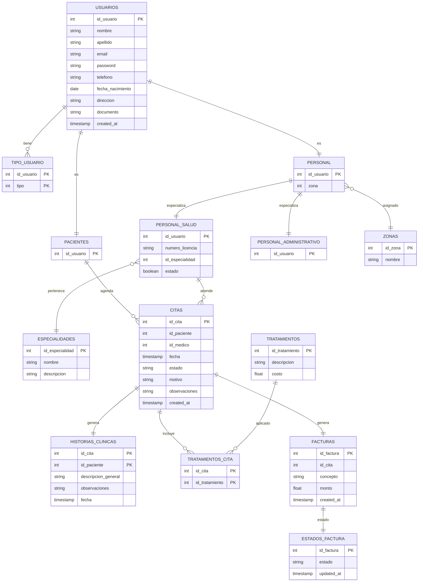

# SYNAPSE

System for Networked Administration and Patient Services Environment

---

## Description

SYNAPSE is a web application designed for the digital management of clinical and administrative information in small- and medium-sized healthcare institutions. Its purpose is to centralize data in a relational database, allowing it to be accessed and updated in an organized and secure manner by authorized users.

---

## Project Architecture

```
synapse/
│
├── backend/
│   ├── src/
│   │   ├── config/
│   │   ├── controllers/
│   │   ├── routes/
│   │   ├── models/
│   │   ├── services/
│   │   └── app.js
│   │
│   ├── package.json
│   └── .env
│
├── frontend/
│   ├── pages/
│   ├── js/
│   ├── css/
│   └── index.html
│
├── database/
│   ├── schema.sql
│   ├── seed.sql
│
├── docs/
│   └── semantica.pdf
│
└── README.md
```

---

## Database Model



---