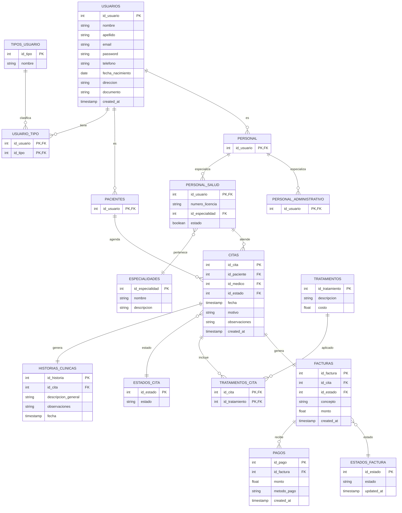

# SYNAPSE

System for Networked Administration and Patient Services Environment

---

## Description

SYNAPSE is a web application designed for the digital management of clinical and administrative information in small- and medium-sized healthcare institutions. Its purpose is to centralize data in a relational database, allowing it to be accessed and updated in an organized and secure manner by authorized users.

---

## Steps to run app


## Project Architecture

```
synapse/
│
├── backend/
│   ├── database/
│   │   ├── schema.sql
│   │   └── seed.sql
│   ├── src/
│   │   ├── config/
│   │   ├── controllers/
│   │   ├── middlewares/
│   │   ├── models/
│   │   ├── routes/
│   │   ├── scripts/
│   │   ├── services/
│   │   └── app.js
│   │
│   ├── package.json
│   ├── .env.example
│   └── .env
│
├── frontend/
│   ├── css/
│   ├── images/
│   ├── js/
│   ├── pages/
│   └── index.html
│
├── docs/
│   └── Semantica_SYNAPSE.pdf
│
├── .gitignore
├── structure.txt
└── README.md
```

---

## Database Model



---

# Initial Setup
Follow these steps to run the SYNAPSE project locally.

## 1. Clone the repository
```bash
git clone https://github.com/JuanF-Cano/synapse
cd synapse
```


## 2. Configure Environment Variables
Use `backend/.env.example` as reference and create a `.env` file inside `/backend`:
```env
DB_USER=postgres
DB_HOST=localhost
DB_NAME=synapse
DB_PASSWORD=your_password
DB_PORT=5432

JWT_SECRET=your_secret_key
BACKEND_PORT=3000
```

For this, you will need to make sure PostgreSQL is correctly installed beforehand, and an empty database named `synapse` should exist.

## 3. Initialize the Database
```bash
cd backend
npm install
npm run db:init
```
This will:

- Create all tables (`schema.sql`)
- Insert initial data (`seed.sql`)
- Automatically create/update a default admin user with hashed password

Default admin credentials created by `db:init`:

- Email: `admin@synapse.local`
- Password: `SynapseAdmin123!`

To change those credentials, edit `backend/src/scripts/db.js` in `DEFAULT_ADMIN`.


## 4. Run the Backend
```bash
npm run dev
```
Backend will be available at: `http://localhost:3000/api`

## 5. Run the Frontend
Go to back root:
```bash
cd ..
cd frontend
```

### Option A — Open directly
Open in browser: 
```bash
index.html
```

Exmaple:
```bash
C:/.../synapse/frontend/index.html
```

### Option B — Run local server (recommended)
```bash
npx serve .
```
Then open:
```bash
http://localhost:3000
```
Or on another port if port 3000 it's busy.

---

# API Documentation
The API documentation is available at:
```bash
http://localhost:3000/api/docs
```

---

# Authentication & Roles

The system supports multiple roles:

Admin
Medico
Recepcionista
Paciente

Each role has different permissions within the system.

---

# Features
User management with roles
Appointment scheduling system
Medical records (histories)
Treatments management
Billing and payments
Doctor availability tracking
Administrative reports

---

# API Overview
Main endpoints:

```bash
/api/auth
/api/users
/api/doctors
/api/appointments
/api/reports
/api/specialty
/api/docs
```
---